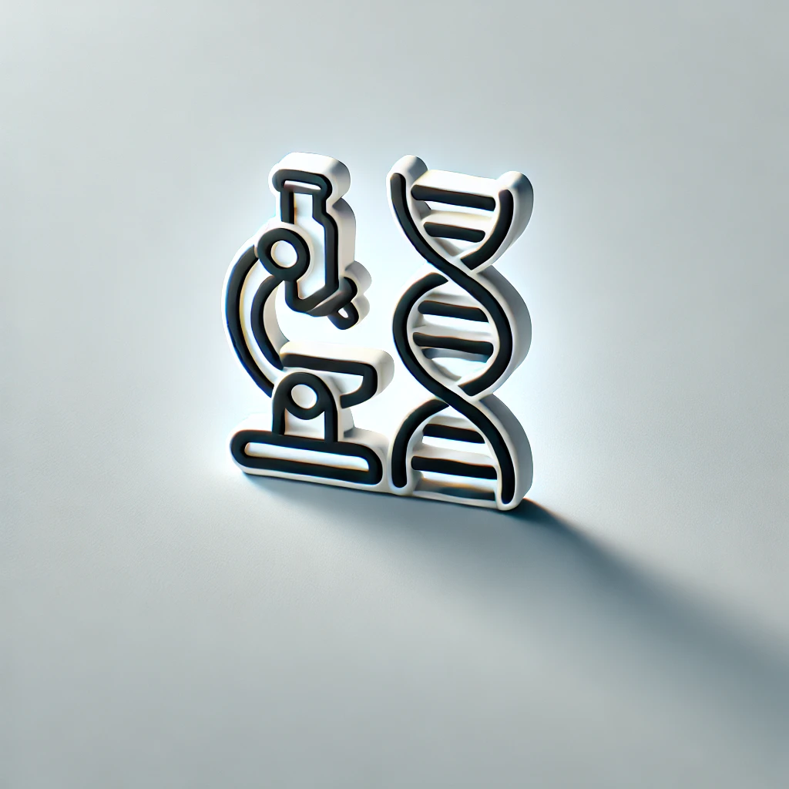

___

## **About Me**
---
       

🧬 First-year Master's student in Life Sciences at the Weizmann Institute of Science, currently participating in lab rotations:
  - **First rotation** – Dr. Meital Oren-Suissa's lab (Department of Brain Sciences)  
  - **Second rotation** – Prof. Eli Arama's lab (Department of Molecular Genetics)
  - **Third rotation** – Prof. Rivka Dikstein's lab (Department of Biomolecular Sciences)

🌱 Undergraduate degree in Biochemistry, Food Science, and Agro-Informatics at the Faculty of Agriculture, Food and Environment of the Hebrew University of Jerusalem.  

🔬 Research experience as a research assistant in Prof. Eran Elinav's lab at the Department of Systems Immunology at the Weizmann Institute of Science, focusing on host-microbiome interactions.
